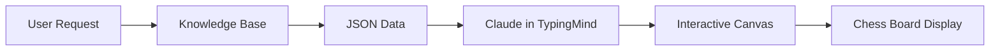

# 🎮 TypingMind Chess Analysis Integration

## How to Display Interactive Chess Board in TypingMind

This guide explains how to use the chess analysis data with TypingMind's Interactive Canvas plugin.

## Prerequisites

✅ **Interactive Canvas** plugin must be enabled in TypingMind (you already have it!)

## How It Works

1. **Python Script Returns JSON Data**
   - Run: `python3 scripts/json_output_for_canvas.py "2025-11-29"`
   - Returns structured JSON with game data and analysis

2. **Claude Generates Interactive Canvas**
   - Receives JSON data from the knowledge base
   - Creates HTML with lichess-pgn-viewer
   - Displays in Interactive Canvas

## Usage in TypingMind

### Step 1: Request Analysis
Say in chat:
```
Show interactive chess analysis for game from November 29 using Interactive Canvas
```

### Step 2: Claude Will Generate Canvas
Claude will create an Interactive Canvas with:
- Chess board visualization
- Move-by-move navigation
- Analysis annotations
- Evaluation display

## Example Prompt for Claude

```
Using the chess game data from the knowledge base (November 29 game),
create an Interactive Canvas with:

1. A chess board using lichess-pgn-viewer
2. Display the PGN with analysis annotations
3. Show accuracy, blunders, mistakes
4. Allow interactive navigation through moves

Use this HTML structure:
<div id="board"></div>
<script src="https://unpkg.com/lichess-pgn-viewer@2.1.0/dist/lichess-pgn-viewer.js"></script>
<link rel="stylesheet" href="https://unpkg.com/lichess-pgn-viewer@2.1.0/dist/lichess-pgn-viewer.css">
<script>
  LichessPgnViewer(document.getElementById('board'), {
    pgn: [PGN from JSON data],
    showMoves: 'right',
    orientation: 'white'
  });
</script>
```

## JSON Data Structure

The script provides:
```json
{
  "game_info": {
    "white_player": "player1",
    "black_player": "player2",
    "result": "1-0",
    "date": "2025-11-29"
  },
  "pgn": "[Full PGN string]",
  "analysis": {
    "accuracy": 85.5,
    "blunders": 1,
    "mistakes": 2
  },
  "moves_analysis": [
    {
      "move": "e4",
      "classification": "good",
      "eval_loss": 0
    }
  ]
}
```

## Interactive Canvas Features

When properly rendered, the canvas will have:
- ✅ Clickable moves to navigate
- ✅ Arrow key navigation (← →)
- ✅ Visual move quality indicators
- ✅ Evaluation display
- ✅ Full PGN with annotations

## Troubleshooting

### Canvas Not Showing?
1. Ensure Interactive Canvas plugin is enabled
2. Use explicit prompt: "Create an Interactive Canvas with..."
3. Check that JSON data is in knowledge base

### Board Not Interactive?
1. Verify lichess-pgn-viewer library is loaded
2. Check JavaScript console for errors
3. Ensure PGN format is valid

## Alternative: Direct HTML Display

If Interactive Canvas doesn't work, request:
```
Show the HTML code for the chess board viewer
```

Then manually create an HTML file and open in browser.

## Commands Reference

| Command | Description |
|---------|-------------|
| `python3 scripts/json_output_for_canvas.py "DATE"` | Get JSON data for a game |
| `python3 scripts/analyze_game_on_demand.py "DATE"` | Full analysis with Stockfish |
| `python3 scripts/main.py --skip-fetch` | Update knowledge base |

## Integration Flow



## Benefits

1. **No External Tools** - Everything in TypingMind
2. **Interactive Experience** - Full chess board functionality
3. **Real Analysis** - Stockfish evaluation included
4. **Cached Data** - Instant loading

---

*For technical support, see the main README.md*